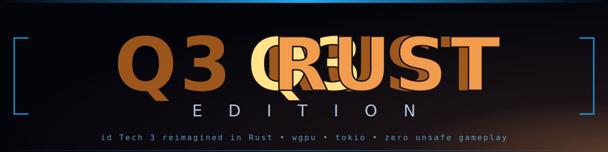

<div align="center">



#### *id Tech 3 reimagined in Rust — modern engine, classic gameplay*

[](https://github.com/)
[](https://www.rust-lang.org/)
[](#licence)
[](#tests)
[](https://wgpu.rs/)

</div>

---

> **Quake 3 RUST EDITION** est une réécriture moderne de *Quake III Arena* (1999) en Rust pur. On garde la **compatibilité totale des assets** (BSP v46, PK3, MD3, shader scripts) et la **physique canonique** (strafe-jump, slide, bunnyhop, hauteurs de hull asymétriques) — mais le moteur entier est reconstruit avec wgpu, tokio, glam, et zéro `unsafe` business-logic. Le résultat : Quake 3 sur ton 32:9 avec lag-comp, follow-cam, démos rejouables, et un netcode authoritative qui tient le LAN.

---

## ✨ Nouveautés v0.5

| Catégorie | Feature |
|---|---|
| **Multijoueur** | Lag compensation hitscan (rewind 250 ms client-perceived) |
| **Multijoueur** | Mode TDM avec friendly-fire toggleable + scoreboard team-grouped |
| **Multijoueur** | Démo replay `.q3rdm` (record snapshots → replay deterministe) |
| **Spectateur** | Follow-cam POV (LMB/RMB cycle joueurs vivants) |
| **Communication** | Quick-chat wheel (V → 8 messages prédéfinis radial) |
| **HUD** | Item respawn timers (MH/RA/YA + powerups en cooldown) |
| **HUD** | Safe-area 16:9 sur ultra-wide 21:9 / 32:9 |
| **Rendu** | Bloom additif post-process (extract → blur → composite) |
| **Rendu** | FOV horizontal Hor+ (cg_fov correctement scalé sur tout aspect) |
| **Polish** | Muzzle origin correct (projectiles sortent du canon, pas du visage) |
| **Polish** | Viewmodel positionné contre l'épaule (pas flottant) |
| **Polish** | Sons d'arme avec fallback multi-paths (warn diagnostique) |

## 🎮 Features complètes

<details>
<summary><b>Rendu & Pipeline graphique</b></summary>

- [x] `wgpu` cross-API (Vulkan / DX12 / Metal) en remplacement d'OpenGL 1.x
- [x] BSP v46 surfaces (lightmap atlas + diffuse multi-stage)
- [x] Shader script parser (`.shader` Q3 vanilla)
- [x] MD3 loader + viewmodels 9 armes + tag attachments
- [x] Skybox procédural + cubemap support
- [x] Particles, decals, dlights, beams, flares, fog volumes
- [x] **Bloom additif** (post-process LDR, threshold + gauss séparable)
- [x] **FOV Hor+** automatique sur 4:3 / 16:9 / 21:9 / 32:9
- [x] Muzzle flash 3D via `tag_flash` MD3
- [ ] HDR pipeline complet (Rgba16Float partout + ACES tonemap) — *roadmap v0.6*
- [ ] Cascaded shadow maps — *roadmap*
- [ ] PBR materials — *roadmap*

</details>

<details>
<summary><b>Physique & Gameplay</b></summary>

- [x] Player movement Q3-canon (strafe-jump, accel air, friction, slide)
- [x] BSP collision brushes (trace_box + asymmetric hull)
- [x] Pickups (18 types), armes (9), powerups (Quad, Regen, Haste, BSuit, Invis, Flight)
- [x] Jump pads, téléporteurs, hurt zones, fall damage
- [x] Deathmatch complet (frags, fraglimit, intermission, respawn)
- [x] **TDM** (free / red / blue) + friendly-fire optionnel
- [x] Bots IA (FSM Idle/Roam/Combat, skill 1..5, voice taunts)
- [ ] Patches Bézier (surfaces courbes) — *roadmap*
- [ ] CTF gametype — *roadmap*

</details>

<details>
<summary><b>Réseau & Multijoueur</b></summary>

- [x] UDP authoritative server, snapshot 20 Hz, usercmd 60 Hz
- [x] Delta-compression snapshots (baseline + dirty bits)
- [x] NetChannel fragmentation
- [x] Client prediction + rewind/replay réconciliation
- [x] Handshake OOB (challenge → connect → connected)
- [x] **Lag compensation** ring-buffer 30 entrées/slot, rewind ≤ 250 ms
- [x] Spectator mode + follow-cam POV
- [x] Démos `.q3rdm` (record + replay)
- [x] Chat (slash `/say`, quick-chat V wheel)
- [ ] Voice chat (Opus / WebRTC) — *roadmap*
- [ ] Server browser LAN — *roadmap*

</details>

<details>
<summary><b>UX & HUD</b></summary>

- [x] Menu principal animé + options persistées (`q3config.cfg`)
- [x] Console slash-commands + history + autocomplete
- [x] HUD moderne (panels anthracite + accents cyan)
- [x] Kill-feed, chat-feed, scoreboard team-grouped
- [x] Item respawn timers en haut-gauche
- [x] Damage indicator (pain arrow direction)
- [x] Quick-chat radial wheel (V key)
- [x] Multi-aspect : safe-area HUD 16:9 sur ultra-wide
- [x] Screenshot F11 (TGA 32-bit)
- [x] FPS overlay (F9)

</details>

## 🛠️ Architecture du workspace

```
crates/
├── q3-math         Primitives math (vec3, mat4, plane, aabb) + conventions Q3
├── q3-common       Cvar, Cmd, erreurs, logger
├── q3-filesystem   Virtual FS : .pk3 (zip) + fichiers loose
├── q3-bsp          Parseur IBSP v46 (tous les lumps)
├── q3-shader       Parser scripts .shader + registry
├── q3-image        Décodeur TGA / JPG / PNG
├── q3-model        MD3 (viewmodels, player, items)
├── q3-collision    cmod : BSP tree + trace_box + asymmetric hull
├── q3-sound        Audio rodio (WAV / OGG, positionnel 3D)
├── q3-net          Netcode UDP (handshake, NetChannel, snapshots, deltas)
├── q3-bot          IA bots : FSM + skill scaling
├── q3-renderer     Renderer wgpu + post-process (bloom)
├── q3-game         Logique de jeu (entités, physique, triggers)
└── q3-engine       Binaire principal — App + net + HUD + bots locaux
```

## 🚀 Build & Run

### Prérequis

- Rust **1.78+** (stable)
- GPU compatible Vulkan / DirectX 12 / Metal
- `baseq3/pak0.pk3` de Quake III Arena (auto-détecté Steam/retail, ou via `--base`)

### Build

```bash
# Debug
cargo build

# Release optimisé
cargo build --release -p q3-engine
```

### Run

```bash
# Solo, map de démarrage
cargo run --release -p q3-engine -- --map maps/q3dm1.bsp

# Solo + bots
cargo run --release -p q3-engine -- --map maps/q3dm6.bsp --bots 4

# Hôte serveur multijoueur (TDM, no friendly fire)
cargo run --release -p q3-engine -- \
  --host 0.0.0.0:27960 --map maps/q3tourney2.bsp \
  --gametype tdm --no-friendly-fire --max-clients 8

# Client connecté
cargo run --release -p q3-engine -- --connect 192.168.1.10:27960 --team red

# Spectateur (sans body)
cargo run --release -p q3-engine -- --connect 192.168.1.10:27960 --spectate

# Enregistre une démo
cargo run --release -p q3-engine -- \
  --connect 192.168.1.10:27960 --record matches/match-001.q3rdm

# Rejoue une démo
cargo run --release -p q3-engine -- --play matches/match-001.q3rdm
```

### Variables d'environnement

| Variable | Effet |
|---|---|
| `Q3_BASE` | Chemin vers `baseq3/` (override de l'auto-détection) |
| `Q3_AUTOSHOT=<sec>` | Screenshot auto + exit après N secondes (debug/CI) |
| `RUST_LOG` | Niveau de log : `info`, `debug`, `trace` |

## 🎯 Contrôles

| Touche | Action |
|---|---|
| **WASD / ZQSD** | Mouvement |
| **Souris** | Look |
| **LMB** | Tir / cycle next (spectator) |
| **RMB** | Cycle prev (spectator) |
| **SPACE** | Saut / free-fly (spectator) |
| **CTRL** | Crouch |
| **SHIFT** | Walk |
| **1-9** | Sélection arme (ou message si V active) |
| **X** | Last weapon |
| **TAB** (maintenu) | Scoreboard |
| **V** | Quick-chat wheel |
| **T** | Chat console |
| **Y** | Team chat *(roadmap)* |
| **ENTER** | Activer holdable (medkit/teleporter) |
| **F3** | Player taunt |
| **F5** | Restart match |
| **F9** | FPS overlay |
| **F11** | Screenshot |
| **`** / **²** | Console |
| **ESC** | Menu / cancel chat-wheel / quitter |

## 🧪 Tests

```bash
# Tous les tests
cargo test --workspace

# Crate spécifique
cargo test -p q3-engine
cargo test -p q3-renderer
```

**280+ tests** verts répartis sur 14 crates :
- physique (collision, slide, jump asymétrique)
- netcode (handshake, delta, lag-comp, démos)
- gameplay (TDM, FF gate, scoreboard, follow-cam)
- rendu (FOV multi-aspect, bloom resources)

## 📜 Licence

Code Rust sous **GPL-2.0-or-later**, identique à la release officielle d'id Software (août 2005).

Les assets du jeu (`pak0.pk3`) ne sont **pas** inclus — tu dois posséder une copie de Quake III Arena (Steam, retail) pour les utiliser.

---

<div align="center">

**v0.5** — *L'engine est prêt, place au gameplay* 🦀💥

</div>
