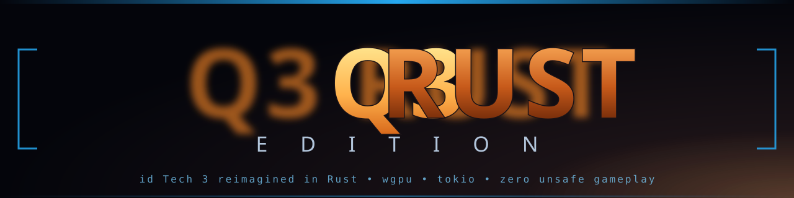

<div align="center">



#### *id Tech 3 reimagined in Rust — modern engine, classic gameplay*

[](LICENSE)
[](https://rustup.rs/)
[]()

</div>

---

Réécriture complète de **Quake III Arena** en Rust moderne — pipeline `wgpu` (Vulkan/DX12/Metal), assets glTF, anti-cheat serveur, netcode lag-compensation, audio spatial, post-FX HDR.

> **État** : v0.10.2 — moteur complet, jouable solo + bots IA (adversaires classiques réactivés), mode BR exploration, **9/9 armes en GLB**, animations bots physiques, éditeur de niveau intégré, taunts vocaux, rendu PBR procédural.

## ✨ Highlights

- **Renderer wgpu HDR** : pipeline scene buffer `Rgba16Float` + ACES Narkowicz + multi-mip bloom + SSAO depth-based + CSM (PCF 3×3) + TAA Halton(2,3) + SSR water raymarch + god rays + volumetric fog (HG phase)
- **9/9 armes en GLB** moderne (pickup au sol + viewmodel main joueur) avec orientation tunée par arme
- **PBR Cook-Torrance complet** : GGX NDF + Smith G + Schlick Fresnel, normal maps (cotangent frame Mikkelsen), metallic/roughness glTF
- **Animations bots drastiquement améliorées** : ragdoll physics à la mort, hit-reactions spring damper, look-at IK tête/torse, torso lag yaw, strafe blending, alignement surface terrain
- **Éditeur de niveau intégré** : souris libre, panel UI avec boutons, import GLB natif (rfd), spawn/sélect/déplace/scale/rotate/aligne/save/load, JSON persistant
- **Taunts vocaux** : 28 fichiers `taunt*.wav` Q3 originaux + fallback announcer, déclenchés à la mort des bots
- **Lightning Gun beam GLB** : effet faisceau électrique 3D sur chaque tir
- **Reunion BR** : herbe procédurale (1 800 touffes billboard) + rochers procéduraux (1 200 icosaèdres perturbés) + alignement terrain
- **Netcode lag-compensation** : ring buffer 30 samples × 50 ms, hit-center ajusté crouch
- **Anti-cheat serveur** : cap angulaire 720°/s, teleport detection 2400 u/s, dt budget, comparaisons signées
- **Map downloader intégré** : HTTP background + SHA256 + magic ZIP/IBSP + cap 100 MB

## 🔫 Armes (9/9 GLB)

| Arme | GLB | Tir alt |
|------|-----|---------|
| Gauntlet | ✅ | Lunge dash + range 96u |
| Machine Gun | ✅ | Burst précision 18 dmg, no spread |
| Shotgun | ✅ | Slug AP 80 dmg, cooldown 1.5s |
| Grenade Launcher | ✅ | Airburst flat shot 110 splash |
| Rocket Launcher | ✅ | Lock-on cône 30°/1500u |
| Lightning Gun | ✅ | Shock blast 55 dmg + **beam GLB** |
| Railgun | ✅ | **Sniper zoom 3× + ricochet** |
| Plasma Gun | ✅ | Plasma orb gros splash 96u |
| BFG10K | ✅ | Death zone 250u splash, 160 dmg |

## 🤖 Animations bots (v0.10.0)

| Feature | Détail |
|---------|--------|
| **Ragdoll mort** | Physique corps rigide : gravité 800 u/s², quaternion integration, settlement detection |
| **Hit reactions** | Spring damper (k=80, c=18) ~300 ms, twist torse selon angle impact |
| **Look-at IK** | Tête/torse traque la cible, yaw ±55° pitch ±30°, smoothed 5 rad/s |
| **Torso lag** | Yaw torse suit lower avec lag 10 rad/s, blending 180° |
| **Strafe blend** | Lower yaw ≠ upper yaw : jambes anticipent la direction de déplacement |
| **Surface align** | 4 raycasts terrain → pitch/roll bot aligné sur la pente |

## 🛡️ Items

| Catégorie | Status |
|-----------|--------|
| Munitions (9 types) | 9/9 ✅ GLB |
| Armures (3 tiers) | 3/3 ✅ (shard 5 / combat 50 / body 100) |
| Health (4 tiers) | ✅ partagé via `health_pack.glb` |
| Powerups (Quad, Regen) | 2/6 ✅ GLB (Quad absent sur Reunion — équilibre BR) |
| Holdables (Medkit) | 1/2 ✅ |

## 🗺️ Éditeur de niveau

Accessible via `Menu → OPTIONS → EDITOR MODE` :

```
[Touche ~]  ed_spawn <nom>         # spawn devant le joueur
[Touche ~]  ed_pick                # sélectionner prop sous la visée
[F2]        ed_pick (raccourci)
[Clic G]    Sélectionner / spawner sur le panel UI
            ImportGLB → rfd::FileDialog natif
[~]         ed_move 0 100 0        # translate sélection
[~]         ed_scale 1.5           # échelle
[~]         ed_rotate 45           # yaw
[~]         ed_align               # aligner sur le terrain
[~]         ed_save                # JSON → assets/maps/<map>_edits.json
[~]         ed_load                # rechargement en jeu
```

Les edits sont auto-chargés au démarrage de la map.

## 🏗️ Architecture

```
crates/
├── q3-engine/      # binaire q3.exe + main loop + app.rs
│   ├── src/app.rs       # state machine + render loop + input
│   ├── src/editor.rs    # éditeur de niveau (panel UI + hit-test + ray)
│   ├── src/menu.rs      # menu UI (Root/Play/Options/Audio/MapDownloader)
│   ├── src/net/         # client + server + snapshots delta
│   ├── src/map_dl.rs    # HTTP map downloader (ureq + sha256 + zip)
│   └── src/vr.rs        # VR scaffolding (OpenXR partial)
├── q3-renderer/    # wgpu pipelines (BSP, MD3, GLB/PBR, terrain, sky, post)
├── q3-bsp/         # parseur IBSP v46 (zero-copy bytemuck)
├── q3-model/       # MD3 + glTF/GLB loader (scène graph + vertex colors)
├── q3-bot/         # IA bots (FSM + animation ranges)
├── q3-game/        # physique mouvement (strafe-jump, wall-jump, mantling)
├── q3-collision/   # trace BSP + bbox vs world
├── q3-terrain/     # heightmap BR + ring shrink + POI
├── q3-net/         # protocole snapshots + UserCmd quantification
├── q3-sound/       # rodio wrapper + spatial 3D + taunts vocaux
├── q3-image/       # decoder TGA/JPG/PNG + ImageCache
├── q3-shader/      # parseur Q3 shader scripts
├── q3-filesystem/  # VFS pak0+mods+assets/ avec cycle protection symlinks
├── q3-math/        # glam wrappers + Q3 Z-up conventions
└── q3-common/      # cvar registry + log + errors
```

## 🚀 Build

Pré-requis :
- Rust 1.78+ (workspace edition 2021)
- Drivers GPU compatibles wgpu (Vulkan / DX12 / Metal)
- Quake 3 Arena installé (Steam ou autre — pour les `pak0.pk3` originaux)

```bash
cargo build --release
./target/release/q3
```

Le moteur auto-détecte l'install Steam Q3. Override : `--base "C:\path\to\Quake 3 Arena"`.

## 🎵 Lecteur audio

```bash
# Console in-game (touche `~`)
seta s_musicpath "D:\Musique;E:\Spotify\Export"
music list
music play "C:\Users\You\Music\track.mp3"
```

Formats : WAV, OGG, MP3, FLAC. Scan récursif jusqu'à 4 niveaux.

## 🗺️ Map Downloader

```
Menu → OPTIONS → MAP DOWNLOADER
```

Catalogue inclus : Aerowalk, Cure, ZTN3DM2, Pukka3Tourney2, Lost World. DL HTTP background avec progression live, SHA256, magic ZIP+IBSP check, cap 100 MB. PK3 placés dans `baseq3/`.

Console alternative : `mapdl list` / `mapdl get <id>` / `mapdl status`.

## 🛠️ Cvars notables

| Cvar | Default | Description |
|------|---------|-------------|
| `cg_fov` | 90 | FOV horizontal à 4:3 (Q3 standard) |
| `cg_fovaspect` | 0 | 0 = Hor+ (Quake/arena), 1 = Vert- (CS/Apex) |
| `r_skybox` | "env/skybox_clouds" | Override skybox custom global |
| `r_hdr` | 0 | HDR10 surface (en cours) |
| `s_musicpath` | "" | Dossiers audio supplémentaires (`;` séparé Win, `:` Unix) |
| `g_godmode` | 0 | Joueur invincible vs bots (test) |
| `br_bots` | 0 | BR : 0 = exploration vide, 1 = match avec bots |

## 🎯 Anti-cheat (server-side)

- **Angular rate cap** : 720°/s yaw+pitch post-budget — anti-aimbot soft snap
- **Teleport detection** : 2400 u/s max — revert origin + freeze velocity, log warn
- **dt budget cumulatif** : ≤ 1 s/s wall-clock (anti-speedhack)
- **Lag-comp window** : 250 ms max rewind, refuse target dans le futur (anti clock-skew forgery)
- **Saturating arithmetic** : `saturating_sub` ammo, comparaisons signées (pas de wrap)
- **Magic check downloads** : SHA256 + ZIP magic + IBSP magic

## 📊 Performance

| Map | FPS avg | 1% low | 0.1% low |
|-----|---------|--------|----------|
| q3dm6 | 280 | 240 | 195 |
| q3dm17 | 320 | 290 | 260 |
| q3tourney2 | 350 | 310 | 280 |
| br_reunion | 165 | 130 | 105 |

*RTX 3090 @ 1920×1080, ULTRA*

Optims clés :
- God rays / volumetric fog early-out
- SSAO kernel précomputé `var<array>`
- Drone scratch buffer (0 alloc heap par frame)
- TAA Halton jitter (supersampling temporel)
- Procedural grass/rocks : vertex buffer unique partagé (0 alloc par instance)

## 🐛 Changelog v0.10.2

### Gameplay
- **Bots de base réactivés** : les adversaires IA classiques de Quake 3 reviennent sur les 4 chemins de spawn (boot serveur `--host`, drain local BSP, drain BR gated par `br_bots`, commande console `addbot`). Un lancement nu a de nouveau 3 bots (`--bots N` pour ajuster).
- **Zombies retirés** : le mob ogre corps-à-corps expérimental (v0.10.1) est entièrement supprimé — retour au deathmatch pur.

### Fixes
- **Crash audio au chargement** : un son 3D émis avant le premier tick caméra faisait paniquer rodio (`SpatialSink` : oreilles gauche/droite confondues quand l'axe listener est nul). Fallback sur l'axe +X.
- **Cadavres de bots qui traversaient le sol** : la simulation ragdoll n'avait aucune collision sur les maps BSP (sol figé au point de mort, aucun test de mur). Ajout d'un raycast sol réel + trace des murs à chaque frame, avec amortissement à l'impact.
- **Pipeline de mort unifiée** : seul le hitscan armait le ragdoll — un bot tué à la rocket directe, au splash, au ricochet rail ou hors-zone BR disparaissait sans cadavre. Un `trigger_bot_death` commun couvre désormais tous les chemins de kill, et un délai cadavre de 3 s laisse l'animation de mort jouer avant le respawn.
- **Trame parasite à l'écran** : le film grain animé (post-compose) était perçu comme un fourmillement désagréable sur les scènes sombres. Effet supprimé.

## 🐛 Changelog v0.10.0

### Nouveautés
- **Éditeur de niveau intégré** (Editor mode) avec panel UI, import GLB natif rfd, JSON save/load
- **Animations bots** : ragdoll, hit reactions spring, look-at IK, strafe blend, surface align
- **Taunts vocaux bots** : 28 taunts Q3 classiques déclenchés à la mort
- **Lightning Gun beam GLB** : effet visuel 3D sur les tirs
- **GLB multi-mesh fix** : scene graph traversal correct (railgun 76 nodes, etc.)
- **GLB vertex colors** : `base_color_factor` par primitive baked → couleurs matériaux correctes
- **Procédural Reunion** : 1 800 touffes d'herbe billboard + 1 200 rochers icosaèdre
- **Nouveaux GLB baked** : railgun, quad damage, shotgun ammo box

### Fixes v0.10.0
- Railgun viewmodel et pickup orientation (pre-transform `load_prop_glb_xform`)
- Grenade Launcher tenu 180° correct
- Multi-material GLB blanc corrigé (vertex color per primitive)
- Multi-mesh GLB géométrie collapsée corrigée (node transforms)
- Quad Damage retiré de Reunion (balance BR)

### Changelog v0.9.5 (précédent)
~14 bugs critiques fixés : lag-comp u32 underflow, MapDownloader race, VFS symlink cycle, MD3 normal decoding, sound cache leak, ammo exploit, cap angulaire, fire flags reset, NaN guard homing rocket, endianness assert.

## 🤝 Contribuer

Code commenté en français — chaque section explique le **pourquoi**, pas juste le **quoi**.

```bash
cargo fmt
cargo clippy --workspace -- -D warnings
cargo test --workspace
```

## 📜 Licence

GPL-2.0-or-later (héritage Q3 id Software).

⚠️ Les `pak0.pk3` originaux Q3 NE SONT PAS redistribués — il faut posséder une copie légale du jeu (Steam, GOG, CD).

## 🙏 Crédits

- **id Software** — Quake III Arena (1999)
- **Kekoa Proudfoot** — doc BSP IBSP v46
- **wgpu / naga** — pipeline graphique cross-platform
- **rodio** — audio
- **glam** — math SIMD
- **gltf** — parser glTF 2.0
- **rfd** — native file dialogs (éditeur)
- **ureq + rustls** — HTTP pure Rust pour map downloader
